# 📋 TÀI LIỆU ĐẶC TẢ YÊU CẦU PHẦN MỀM (SRS)

## HỆ THỐNG QUẢN LÝ SIÊU THỊ MINI


## 📑 MỤC LỤC

1. [Giới thiệu](#1-giới-thiệu)
2. [Mô tả tổng quan](#2-mô-tả-tổng-quan)
3. [Actors (Tác nhân)](#3-actors-tác-nhân)
4. [Danh sách Use Case](#4-danh-sách-use-case)
5. [Đặc tả chi tiết Use Case](#5-đặc-tả-chi-tiết-use-case)
6. [Yêu cầu chức năng](#6-yêu-cầu-chức-năng)
7. [Yêu cầu phi chức năng](#7-yêu-cầu-phi-chức-năng)
8. [Biểu đồ Mermaid](#8-biểu-đồ-mermaid)
9. [Phụ lục](#9-phụ-lục)
10. [Lịch sử thay đổi](#10-lịch-sử-thay-đổi)

---

## 1. GIỚI THIỆU

### 1.1 Mục đích tài liệu

Tài liệu này mô tả đầy đủ các yêu cầu chức năng và phi chức năng của Hệ thống Quản lý Siêu thị Mini, bao gồm:
- Các tác nhân (Actors) tương tác với hệ thống
- Danh sách và đặc tả chi tiết các Use Case
- Luồng hoạt động của từng chức năng
- Các ràng buộc và yêu cầu hệ thống

### 1.2 Phạm vi hệ thống

Hệ thống Quản lý Siêu thị Mini là giải pháp quản lý toàn diện dành cho các cửa hàng bán lẻ quy mô nhỏ và vừa, hỗ trợ:
- Quản lý nhân sự (Admin only)
- Quản lý sản phẩm và danh mục
- Quản lý tồn kho đa cửa hàng
- Quản lý đơn hàng và bán hàng
- Báo cáo và thống kê kinh doanh

### 1.3 Định nghĩa và từ viết tắt

| Thuật ngữ | Định nghĩa |
|-----------|------------|
| **UC** | Use Case - Ca sử dụng |
| **API** | Application Programming Interface |
| **JWT** | JSON Web Token |
| **CRUD** | Create, Read, Update, Delete |
| **NCC** | Nhà cung cấp |
| **SP** | Sản phẩm |
| **SKU** | Stock Keeping Unit - Mã quản lý hàng hóa |

---

## 2. MÔ TẢ TỔNG QUAN

### 2.1 Kiến trúc hệ thống

```
┌─────────────────────────────────────────────────────────────────────────┐
│                           CLIENT LAYER                                   │
│  ┌─────────────────────────────────────────────────────────────────────┐│
│  │                      Vue.js 3 + Pinia + Vue Router                  ││
│  │                       (Responsive Web Application)                   ││
│  └─────────────────────────────────────────────────────────────────────┘│
└─────────────────────────────────────────────────────────────────────────┘
                                    │
                                    │ HTTP/HTTPS
                                    │ REST API + JWT
                                    ▼
┌─────────────────────────────────────────────────────────────────────────┐
│                           SERVER LAYER                                   │
│  ┌─────────────────────────────────────────────────────────────────────┐│
│  │                    Node.js + Express.js                              ││
│  │              (RESTful API Server - 67 Endpoints)                     ││
│  └─────────────────────────────────────────────────────────────────────┘│
└─────────────────────────────────────────────────────────────────────────┘
                                    │
                                    │ pg (node-postgres)
                                    │
                                    ▼
┌─────────────────────────────────────────────────────────────────────────┐
│                          DATABASE LAYER                                  │
│  ┌─────────────────────────────────────────────────────────────────────┐│
│  │                    PostgreSQL 14+                                    ││
│  │                  (Snowflake Schema)                                  ││
│  └─────────────────────────────────────────────────────────────────────┘│
└─────────────────────────────────────────────────────────────────────────┘
```

### 2.2 Các module chức năng

| # | Module | Mô tả | Số API |
|:-:|--------|-------|:------:|
| 1 | Authentication | Xác thực và phân quyền | 5 |
| 2 | Staff Management | Quản lý nhân viên (Admin only) | 6 |
| 3 | Profile Management | Quản lý hồ sơ cá nhân | 5 |
| 4 | Product Management | Quản lý sản phẩm | 9 |
| 5 | Collection Management | Quản lý danh mục | 5 |
| 6 | Dashboard & Reports | Báo cáo và thống kê | 7 |
| 7 | Catalog Management | Quản lý bảng giá | 4 |
| 8 | Inventory Management | Quản lý tồn kho | 9 |
| 9 | Product Images | Quản lý ảnh sản phẩm | 7 |
| 10 | Order Management | Quản lý đơn hàng | 10 |
| | **Tổng cộng** | | **67** |

---

## 3. ACTORS (TÁC NHÂN)

### 3.1 Biểu đồ phân cấp Actor

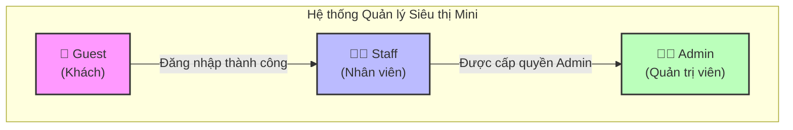

### 3.2 Mô tả chi tiết Actor

#### 3.2.1 Guest (Khách)

| Thuộc tính | Mô tả |
|------------|-------|
| **Định nghĩa** | Người dùng chưa đăng nhập vào hệ thống |
| **Quyền hạn** | Chỉ có thể truy cập trang đăng nhập |
| **Mục tiêu** | Đăng nhập để sử dụng hệ thống |

#### 3.2.2 Staff (Nhân viên)

| Thuộc tính | Mô tả |
|------------|-------|
| **Định nghĩa** | Nhân viên cửa hàng đã đăng nhập với role Staff (role_id = 2) |
| **Quyền hạn** | - Xem danh sách sản phẩm, danh mục, tồn kho<br>- Xem bảng giá, catalog<br>- Tạo và quản lý đơn hàng<br>- Xem báo cáo và dashboard<br>- Quản lý hồ sơ cá nhân |
| **Mục tiêu** | Thực hiện nghiệp vụ bán hàng và xem thông tin |

#### 3.2.3 Admin (Quản trị viên)

| Thuộc tính | Mô tả |
|------------|-------|
| **Định nghĩa** | Người quản trị hệ thống với toàn quyền (role_id = 1) |
| **Quyền hạn** | - **Toàn bộ quyền của Staff**<br>- Quản lý nhân viên (CRUD)<br>- Phân quyền người dùng<br>- CRUD sản phẩm, danh mục<br>- Quản lý giá bán<br>- Nhập/xuất/chuyển kho<br>- Upload/xóa ảnh sản phẩm |
| **Mục tiêu** | Quản trị toàn bộ hệ thống và nghiệp vụ |

### 3.3 Ma trận quyền hạn

| Chức năng | Guest | Staff | Admin |
|-----------|:-----:|:-----:|:-----:|
| **AUTHENTICATION** |
| Đăng nhập | ✅ | ❌ | ❌ |
| Đăng xuất | ❌ | ✅ | ✅ |
| Làm mới token | ❌ | ✅ | ✅ |
| **STAFF MANAGEMENT** |
| Xem danh sách nhân viên | ❌ | ❌ | ✅ |
| Thêm nhân viên | ❌ | ❌ | ✅ |
| Cập nhật nhân viên | ❌ | ❌ | ✅ |
| Xóa nhân viên | ❌ | ❌ | ✅ |
| Phân quyền | ❌ | ❌ | ✅ |
| **PROFILE** |
| Xem hồ sơ cá nhân | ❌ | ✅ | ✅ |
| Cập nhật hồ sơ | ❌ | ✅ | ✅ |
| Đổi mật khẩu | ❌ | ✅ | ✅ |
| Upload avatar | ❌ | ✅ | ✅ |
| **PRODUCTS** |
| Xem sản phẩm | ❌ | ✅ | ✅ |
| Thêm sản phẩm | ❌ | ❌ | ✅ |
| Sửa sản phẩm | ❌ | ❌ | ✅ |
| Xóa sản phẩm | ❌ | ❌ | ✅ |
| Import/Export CSV | ❌ | ✅ | ✅ |
| **COLLECTIONS** |
| Xem danh mục | ❌ | ✅ | ✅ |
| Thêm danh mục | ❌ | ❌ | ✅ |
| Sửa danh mục | ❌ | ❌ | ✅ |
| Xóa danh mục | ❌ | ❌ | ✅ |
| **INVENTORY** |
| Xem tồn kho | ❌ | ✅ | ✅ |
| Nhập/Chuyển kho | ❌ | ❌ | ✅ |
| Điều chỉnh tồn kho | ❌ | ❌ | ✅ |
| **CATALOG** |
| Xem bảng giá | ❌ | ✅ | ✅ |
| Cập nhật giá | ❌ | ❌ | ✅ |
| **ORDERS** |
| Xem đơn hàng | ❌ | ✅ | ✅ |
| Tạo đơn hàng | ❌ | ✅ | ✅ |
| Cập nhật đơn hàng | ❌ | ✅ | ✅ |
| Hủy đơn hàng | ❌ | ✅ | ✅ |
| **REPORTS** |
| Xem báo cáo | ❌ | ✅ | ✅ |
| Xem Dashboard | ❌ | ✅ | ✅ |
| **PRODUCT IMAGES** |
| Xem ảnh sản phẩm | ❌ | ✅ | ✅ |
| Upload ảnh | ❌ | ❌ | ✅ |
| Xóa ảnh | ❌ | ❌ | ✅ |

---

## 4. DANH SÁCH USE CASE

### 4.1 Tổng quan Use Case theo Module

| Module | Số UC | Mã UC |
|--------|:-----:|-------|
| Authentication | 5 | UC01 - UC05 |
| Staff Management | 6 | UC06 - UC11 |
| Profile Management | 5 | UC12 - UC16 |
| Product Management | 8 | UC17 - UC24 |
| Collection Management | 5 | UC25 - UC29 |
| Dashboard & Reports | 7 | UC30 - UC36 |
| Catalog Management | 4 | UC37 - UC40 |
| Inventory Management | 7 | UC41 - UC47 |
| Product Images | 5 | UC48 - UC52 |
| Order Management | 6 | UC53 - UC58 |
| **Tổng cộng** | **58** | |

### 4.2 Danh sách chi tiết Use Case

#### 📦 Module 1: Authentication (Xác thực)

| Mã UC | Tên Use Case | Actor | Mô tả ngắn |
|-------|--------------|-------|------------|
| UC01 | Đăng nhập | Guest | Đăng nhập vào hệ thống |
| UC02 | Đăng xuất | Staff, Admin | Đăng xuất khỏi hệ thống |
| UC03 | Làm mới token | Staff, Admin | Làm mới JWT token |
| UC04 | Xem thông tin đăng nhập | Staff, Admin | Xem thông tin user hiện tại |
| UC05 | Xem danh sách quyền | Staff, Admin | Xem các quyền của role |

#### 📦 Module 2: Staff Management (Quản lý nhân viên)

| Mã UC | Tên Use Case | Actor | Mô tả ngắn |
|-------|--------------|-------|------------|
| UC06 | Xem danh sách nhân viên | Admin | Xem danh sách tất cả nhân viên |
| UC07 | Thêm nhân viên | Admin | Thêm nhân viên mới |
| UC08 | Xem chi tiết nhân viên | Admin | Xem thông tin chi tiết nhân viên |
| UC09 | Cập nhật nhân viên | Admin | Cập nhật thông tin nhân viên |
| UC10 | Xóa nhân viên | Admin | Xóa nhân viên khỏi hệ thống |
| UC11 | Phân quyền nhân viên | Admin | Thay đổi role của nhân viên |

#### 📦 Module 3: Profile Management (Quản lý hồ sơ)

| Mã UC | Tên Use Case | Actor | Mô tả ngắn |
|-------|--------------|-------|------------|
| UC12 | Xem hồ sơ cá nhân | Staff, Admin | Xem thông tin cá nhân |
| UC13 | Cập nhật hồ sơ | Staff, Admin | Cập nhật thông tin cá nhân |
| UC14 | Đổi mật khẩu | Staff, Admin | Thay đổi mật khẩu |
| UC15 | Upload avatar | Staff, Admin | Upload ảnh đại diện |
| UC16 | Xóa avatar | Staff, Admin | Xóa ảnh đại diện |

#### 📦 Module 4: Product Management (Quản lý sản phẩm)

| Mã UC | Tên Use Case | Actor | Mô tả ngắn |
|-------|--------------|-------|------------|
| UC17 | Xem danh sách sản phẩm | Staff, Admin | Xem danh sách sản phẩm |
| UC18 | Thêm sản phẩm | Admin | Thêm sản phẩm mới |
| UC19 | Xem chi tiết sản phẩm | Staff, Admin | Xem thông tin chi tiết |
| UC20 | Cập nhật sản phẩm | Admin | Cập nhật thông tin sản phẩm |
| UC21 | Xóa sản phẩm | Admin | Xóa sản phẩm |
| UC22 | Bật/tắt trạng thái hàng loạt | Admin | Thay đổi trạng thái nhiều SP |
| UC23 | Export sản phẩm CSV | Staff, Admin | Xuất danh sách ra CSV |
| UC24 | Import sản phẩm CSV | Admin | Nhập sản phẩm từ CSV |

#### 📦 Module 5: Collection Management (Quản lý danh mục)

| Mã UC | Tên Use Case | Actor | Mô tả ngắn |
|-------|--------------|-------|------------|
| UC25 | Xem danh sách danh mục | Staff, Admin | Xem danh sách danh mục |
| UC26 | Xem cây danh mục | Staff, Admin | Xem cấu trúc cây |
| UC27 | Thêm danh mục | Admin | Thêm danh mục mới |
| UC28 | Cập nhật danh mục | Admin | Cập nhật thông tin danh mục |
| UC29 | Xóa danh mục | Admin | Xóa danh mục |

#### 📦 Module 6: Dashboard & Reports (Báo cáo)

| Mã UC | Tên Use Case | Actor | Mô tả ngắn |
|-------|--------------|-------|------------|
| UC30 | Xem tổng quan Dashboard | Staff, Admin | Xem số liệu tổng quan |
| UC31 | Xem thống kê | Staff, Admin | Xem thống kê chi tiết |
| UC32 | Xem biểu đồ doanh thu | Staff, Admin | Xem biểu đồ theo thời gian |
| UC33 | Xem top sản phẩm | Staff, Admin | Xem SP bán chạy nhất |
| UC34 | Xem kênh bán hàng | Staff, Admin | Xem thống kê theo kênh |
| UC35 | Xem top khách hàng | Staff, Admin | Xem KH mua nhiều nhất |
| UC36 | Xem SP sắp hết hàng | Staff, Admin | Xem cảnh báo tồn kho thấp |

#### 📦 Module 7: Catalog Management (Bảng giá)

| Mã UC | Tên Use Case | Actor | Mô tả ngắn |
|-------|--------------|-------|------------|
| UC37 | Xem bảng giá | Staff, Admin | Xem danh sách giá SP |
| UC38 | Cập nhật giá SP | Admin | Cập nhật giá sản phẩm |
| UC39 | Cập nhật giá hàng loạt | Admin | Cập nhật giá nhiều SP |
| UC40 | Export bảng giá | Staff, Admin | Xuất bảng giá CSV |

#### 📦 Module 8: Inventory Management (Quản lý tồn kho)

| Mã UC | Tên Use Case | Actor | Mô tả ngắn |
|-------|--------------|-------|------------|
| UC41 | Xem danh sách tồn kho | Staff, Admin | Xem tồn kho các SP |
| UC42 | Xem chi tiết tồn kho | Staff, Admin | Xem tồn kho theo kho |
| UC43 | Điều chỉnh tồn kho | Admin | Điều chỉnh số lượng |
| UC44 | Xem lịch sử xuất nhập | Staff, Admin | Xem lịch sử giao dịch |
| UC45 | Nhập kho | Admin | Nhập hàng từ NCC |
| UC46 | Chuyển kho | Admin | Chuyển hàng giữa kho |
| UC47 | Trả hàng NCC | Admin | Trả hàng cho NCC |

#### 📦 Module 9: Product Images (Ảnh sản phẩm)

| Mã UC | Tên Use Case | Actor | Mô tả ngắn |
|-------|--------------|-------|------------|
| UC48 | Xem ảnh sản phẩm | Staff, Admin | Xem danh sách ảnh SP |
| UC49 | Upload ảnh chính | Admin | Upload ảnh chính SP |
| UC50 | Upload gallery | Admin | Upload nhiều ảnh |
| UC51 | Đặt ảnh chính | Admin | Chọn ảnh làm ảnh chính |
| UC52 | Xóa ảnh sản phẩm | Admin | Xóa ảnh khỏi gallery |

#### 📦 Module 10: Order Management (Quản lý đơn hàng)

| Mã UC | Tên Use Case | Actor | Mô tả ngắn |
|-------|--------------|-------|------------|
| UC53 | Xem danh sách đơn hàng | Staff, Admin | Xem tất cả đơn hàng |
| UC54 | Tạo đơn hàng | Staff, Admin | Tạo đơn hàng mới |
| UC55 | Xem chi tiết đơn hàng | Staff, Admin | Xem chi tiết đơn |
| UC56 | Cập nhật đơn hàng | Staff, Admin | Cập nhật trạng thái |
| UC57 | Hủy đơn hàng | Staff, Admin | Hủy đơn hàng |
| UC58 | Xem thống kê đơn hàng | Staff, Admin | Xem thống kê đơn |

---

## 5. ĐẶC TẢ CHI TIẾT USE CASE

### 5.1 UC01 - Đăng nhập

| Thuộc tính | Mô tả |
|------------|-------|
| **Mã UC** | UC01 |
| **Tên** | Đăng nhập |
| **Actor** | Guest |
| **Mô tả** | Người dùng đăng nhập vào hệ thống bằng tài khoản đã được cấp |
| **Tiền điều kiện** | - Người dùng có tài khoản hợp lệ<br>- Người dùng chưa đăng nhập |
| **Hậu điều kiện** | - Người dùng được cấp JWT token<br>- Chuyển đến trang Dashboard |

**Luồng sự kiện chính:**
| Bước | Actor | Hệ thống |
|:----:|-------|----------|
| 1 | Truy cập trang đăng nhập | Hiển thị form đăng nhập |
| 2 | Nhập username và password | |
| 3 | Nhấn nút "Đăng nhập" | |
| 4 | | Kiểm tra thông tin đăng nhập |
| 5 | | Tạo JWT token |
| 6 | | Trả về token và thông tin user |
| 7 | | Chuyển đến trang Dashboard |

**Luồng sự kiện thay thế:**
| Bước | Điều kiện | Xử lý |
|:----:|-----------|-------|
| 4a | Username không tồn tại | Hiển thị lỗi "Tài khoản không tồn tại" |
| 4b | Password không đúng | Hiển thị lỗi "Mật khẩu không chính xác" |
| 4c | Tài khoản bị khóa | Hiển thị lỗi "Tài khoản đã bị khóa" |

---

### 5.2 UC07 - Thêm nhân viên

| Thuộc tính | Mô tả |
|------------|-------|
| **Mã UC** | UC07 |
| **Tên** | Thêm nhân viên |
| **Actor** | Admin |
| **Mô tả** | Admin thêm nhân viên mới vào hệ thống |
| **Tiền điều kiện** | - Admin đã đăng nhập<br>- Admin có quyền quản lý nhân viên |
| **Hậu điều kiện** | - Nhân viên mới được tạo<br>- Tài khoản sẵn sàng sử dụng |

**Luồng sự kiện chính:**
| Bước | Actor | Hệ thống |
|:----:|-------|----------|
| 1 | Truy cập "Quản lý nhân viên" | Hiển thị danh sách nhân viên |
| 2 | Nhấn "Thêm nhân viên" | Hiển thị form thêm mới |
| 3 | Nhập thông tin nhân viên | |
| 4 | Chọn vai trò (Admin/Staff) | |
| 5 | Nhấn "Lưu" | |
| 6 | | Validate dữ liệu |
| 7 | | Mã hóa password |
| 8 | | Lưu vào database |
| 9 | | Hiển thị thông báo thành công |

**Dữ liệu nhập:**
| Trường | Kiểu | Bắt buộc | Ràng buộc |
|--------|------|:--------:|-----------|
| username | String | ✅ | Unique, 3-50 ký tự |
| email | String | ✅ | Format email hợp lệ |
| full_name | String | ✅ | 2-100 ký tự |
| phone | String | ❌ | 10-11 số |
| password | String | ✅ | Tối thiểu 6 ký tự |
| role_id | Number | ✅ | 1=Admin, 2=Staff |

**Luồng sự kiện thay thế:**
| Bước | Điều kiện | Xử lý |
|:----:|-----------|-------|
| 6a | Username đã tồn tại | Hiển thị lỗi "Username đã được sử dụng" |
| 6b | Email đã tồn tại | Hiển thị lỗi "Email đã được sử dụng" |
| 6c | Dữ liệu không hợp lệ | Hiển thị chi tiết lỗi validation |

---

### 5.3 UC18 - Thêm sản phẩm

| Thuộc tính | Mô tả |
|------------|-------|
| **Mã UC** | UC18 |
| **Tên** | Thêm sản phẩm |
| **Actor** | Admin |
| **Mô tả** | Thêm sản phẩm mới vào hệ thống |
| **Tiền điều kiện** | - Admin đã đăng nhập<br>- Danh mục, thương hiệu, đơn vị đã tồn tại |
| **Hậu điều kiện** | - Sản phẩm được tạo<br>- Variant được tạo với giá mặc định |

**Luồng sự kiện chính:**
| Bước | Actor | Hệ thống |
|:----:|-------|----------|
| 1 | Truy cập "Quản lý sản phẩm" | Hiển thị danh sách sản phẩm |
| 2 | Nhấn "Thêm sản phẩm" | Hiển thị form thêm mới |
| 3 | Nhập thông tin sản phẩm | |
| 4 | Chọn danh mục, thương hiệu, đơn vị | |
| 5 | Nhập thông tin variant (SKU, barcode, giá) | |
| 6 | Nhấn "Lưu" | |
| 7 | | Validate dữ liệu |
| 8 | | Tạo product trong dim_products |
| 9 | | Tạo variant trong dim_product_variants |
| 10 | | Hiển thị thông báo thành công |

**Dữ liệu nhập:**
| Trường | Kiểu | Bắt buộc | Ràng buộc |
|--------|------|:--------:|-----------|
| code | String | ✅ | Unique, max 50 ký tự |
| name | String | ✅ | Max 300 ký tự |
| category_id | Number | ✅ | FK đến subdim_categories |
| brand_id | Number | ❌ | FK đến subdim_brands |
| unit_id | Number | ✅ | FK đến subdim_units |
| description | String | ❌ | Text |
| is_active | Boolean | ❌ | Default: true |
| sku | String | ✅ | Unique |
| barcode | String | ❌ | Unique nếu có |
| cost_price | Decimal | ✅ | >= 0 |
| selling_price | Decimal | ✅ | >= cost_price |

---

### 5.4 UC45 - Nhập kho

| Thuộc tính | Mô tả |
|------------|-------|
| **Mã UC** | UC45 |
| **Tên** | Nhập kho |
| **Actor** | Admin |
| **Mô tả** | Nhập hàng từ nhà cung cấp vào kho |
| **Tiền điều kiện** | - Admin đã đăng nhập<br>- Sản phẩm đã tồn tại trong hệ thống |
| **Hậu điều kiện** | - Số lượng tồn kho được cập nhật<br>- Giao dịch được ghi nhận |

**Luồng sự kiện chính:**
| Bước | Actor | Hệ thống |
|:----:|-------|----------|
| 1 | Truy cập "Quản lý tồn kho" | Hiển thị danh sách tồn kho |
| 2 | Nhấn "Nhập kho" | Hiển thị form nhập kho |
| 3 | Chọn cửa hàng/kho đích | |
| 4 | Thêm các sản phẩm cần nhập | |
| 5 | Nhập số lượng và giá nhập cho từng SP | |
| 6 | Nhập ghi chú (nếu có) | |
| 7 | Nhấn "Xác nhận nhập kho" | |
| 8 | | Validate dữ liệu |
| 9 | | Cập nhật fact_inventory_stocks |
| 10 | | Ghi transaction vào fact_inventory_transactions |
| 11 | | Tạo mã giao dịch (RCV-xxx) |
| 12 | | Hiển thị kết quả và mã giao dịch |

**Dữ liệu nhập:**
| Trường | Kiểu | Bắt buộc | Ràng buộc |
|--------|------|:--------:|-----------|
| store_id | Number | ✅ | FK đến dim_stores |
| items | Array | ✅ | Tối thiểu 1 item |
| items[].variant_id | Number | ✅ | FK đến dim_product_variants |
| items[].quantity | Decimal | ✅ | > 0 |
| items[].unit_cost | Decimal | ✅ | >= 0 |
| notes | String | ❌ | Ghi chú |

---

### 5.5 UC54 - Tạo đơn hàng

| Thuộc tính | Mô tả |
|------------|-------|
| **Mã UC** | UC54 |
| **Tên** | Tạo đơn hàng |
| **Actor** | Staff, Admin |
| **Mô tả** | Tạo đơn hàng mới cho khách hàng |
| **Tiền điều kiện** | - User đã đăng nhập<br>- Sản phẩm có đủ tồn kho |
| **Hậu điều kiện** | - Đơn hàng được tạo<br>- Tồn kho được reserved |

**Luồng sự kiện chính:**
| Bước | Actor | Hệ thống |
|:----:|-------|----------|
| 1 | Truy cập "Quản lý đơn hàng" | Hiển thị danh sách đơn hàng |
| 2 | Nhấn "Tạo đơn hàng" | Hiển thị form tạo đơn |
| 3 | Chọn cửa hàng | |
| 4 | Chọn khách hàng (nếu có) | |
| 5 | Thêm sản phẩm vào đơn | |
| 6 | Nhập số lượng, giá, giảm giá | |
| 7 | Nhập thông tin giao hàng | |
| 8 | Chọn phương thức thanh toán | |
| 9 | Nhấn "Tạo đơn hàng" | |
| 10 | | Validate dữ liệu và tồn kho |
| 11 | | Tính toán tổng tiền |
| 12 | | Tạo đơn hàng trong fact_orders |
| 13 | | Tạo chi tiết trong fact_order_details |
| 14 | | Cập nhật quantity_reserved |
| 15 | | Tạo mã đơn hàng (ORD-xxx) |
| 16 | | Hiển thị kết quả |

**Dữ liệu nhập:**
| Trường | Kiểu | Bắt buộc | Ràng buộc |
|--------|------|:--------:|-----------|
| store_id | Number | ✅ | FK đến dim_stores |
| customer_id | Number | ❌ | FK đến dim_customers |
| items | Array | ✅ | Tối thiểu 1 item |
| items[].variant_id | Number | ✅ | FK đến dim_product_variants |
| items[].quantity | Number | ✅ | > 0, <= tồn kho |
| items[].unit_price | Decimal | ✅ | >= 0 |
| items[].discount_per_item | Decimal | ❌ | >= 0 |
| subtotal | Decimal | ✅ | Tổng tiền hàng |
| discount_amount | Decimal | ❌ | Giảm giá đơn hàng |
| tax_amount | Decimal | ❌ | Thuế |
| shipping_fee | Decimal | ❌ | Phí ship |
| payment_method | String | ❌ | cash, card, bank transfer |
| shipping_address | String | ❌ | Địa chỉ giao |
| customer_note | String | ❌ | Ghi chú KH |
| internal_note | String | ❌ | Ghi chú nội bộ |

**Luồng sự kiện thay thế:**
| Bước | Điều kiện | Xử lý |
|:----:|-----------|-------|
| 10a | Tồn kho không đủ | Hiển thị lỗi và SP thiếu hàng |
| 10b | Sản phẩm không active | Hiển thị lỗi SP đã ngừng bán |

---

### 5.6 UC46 - Chuyển kho

| Thuộc tính | Mô tả |
|------------|-------|
| **Mã UC** | UC46 |
| **Tên** | Chuyển kho |
| **Actor** | Admin |
| **Mô tả** | Chuyển hàng từ kho này sang kho khác |
| **Tiền điều kiện** | - Admin đã đăng nhập<br>- Kho nguồn có đủ hàng |
| **Hậu điều kiện** | - Tồn kho nguồn giảm<br>- Tồn kho đích tăng |

**Luồng sự kiện chính:**
| Bước | Actor | Hệ thống |
|:----:|-------|----------|
| 1 | Truy cập "Quản lý tồn kho" | Hiển thị danh sách |
| 2 | Nhấn "Chuyển kho" | Hiển thị form chuyển kho |
| 3 | Chọn kho nguồn | |
| 4 | Chọn kho đích | |
| 5 | Thêm sản phẩm và số lượng | |
| 6 | Nhập ghi chú | |
| 7 | Nhấn "Xác nhận chuyển kho" | |
| 8 | | Validate tồn kho nguồn |
| 9 | | Tạo transaction TRANSFER_OUT cho kho nguồn |
| 10 | | Tạo transaction TRANSFER_IN cho kho đích |
| 11 | | Cập nhật fact_inventory_stocks |
| 12 | | Hiển thị kết quả |

---

## 6. YÊU CẦU CHỨC NĂNG

### 6.1 Yêu cầu xác thực và phân quyền

| Mã | Yêu cầu | Độ ưu tiên |
|----|---------|:----------:|
| FR01 | Hệ thống phải cho phép đăng nhập bằng username/password | Cao |
| FR02 | Hệ thống phải sử dụng JWT để xác thực API | Cao |
| FR03 | Token phải hết hạn sau 7 ngày | Trung bình |
| FR04 | Hệ thống phải hỗ trợ refresh token | Trung bình |
| FR05 | Hệ thống phải phân quyền theo 2 role: Admin, Staff | Cao |
| FR06 | Password phải được mã hóa bcrypt | Cao |

### 6.2 Yêu cầu quản lý nhân viên

| Mã | Yêu cầu | Độ ưu tiên |
|----|---------|:----------:|
| FR07 | Chỉ Admin mới có quyền quản lý nhân viên | Cao |
| FR08 | Username và email phải là duy nhất | Cao |
| FR09 | Hỗ trợ phân trang khi xem danh sách | Trung bình |
| FR10 | Admin có thể thay đổi role của nhân viên | Cao |

### 6.3 Yêu cầu quản lý sản phẩm

| Mã | Yêu cầu | Độ ưu tiên |
|----|---------|:----------:|
| FR11 | Mã sản phẩm (code) phải là duy nhất | Cao |
| FR12 | Sản phẩm phải thuộc một danh mục | Cao |
| FR13 | Hỗ trợ tìm kiếm theo tên, mã, danh mục | Cao |
| FR14 | Hỗ trợ lọc theo trạng thái, thương hiệu | Trung bình |
| FR15 | Hỗ trợ import sản phẩm từ file CSV | Trung bình |
| FR16 | Hỗ trợ export danh sách ra file CSV | Trung bình |
| FR17 | Cho phép bật/tắt trạng thái nhiều SP cùng lúc | Trung bình |

### 6.4 Yêu cầu quản lý danh mục

| Mã | Yêu cầu | Độ ưu tiên |
|----|---------|:----------:|
| FR18 | Hỗ trợ cấu trúc danh mục phân cấp (cha-con) | Cao |
| FR19 | Mã danh mục phải là duy nhất | Cao |
| FR20 | Không cho xóa danh mục có sản phẩm | Cao |
| FR21 | Không cho xóa danh mục có danh mục con | Cao |

### 6.5 Yêu cầu quản lý tồn kho

| Mã | Yêu cầu | Độ ưu tiên |
|----|---------|:----------:|
| FR22 | Hỗ trợ quản lý tồn kho đa cửa hàng | Cao |
| FR23 | Ghi nhận mọi giao dịch xuất/nhập kho | Cao |
| FR24 | Hỗ trợ nhập kho từ NCC | Cao |
| FR25 | Hỗ trợ chuyển kho giữa các cửa hàng | Cao |
| FR26 | Hỗ trợ trả hàng cho NCC | Trung bình |
| FR27 | Hỗ trợ điều chỉnh tồn kho | Trung bình |
| FR28 | Cảnh báo khi tồn kho dưới mức tối thiểu | Trung bình |

### 6.6 Yêu cầu quản lý đơn hàng

| Mã | Yêu cầu | Độ ưu tiên |
|----|---------|:----------:|
| FR29 | Tự động tạo mã đơn hàng | Cao |
| FR30 | Hỗ trợ nhiều trạng thái: pending, completed, cancelled | Cao |
| FR31 | Hỗ trợ nhiều phương thức thanh toán | Trung bình |
| FR32 | Kiểm tra tồn kho trước khi tạo đơn | Cao |
| FR33 | Hỗ trợ hủy đơn hàng (soft delete) | Cao |
| FR34 | Ghi nhận lý do hủy đơn | Trung bình |

### 6.7 Yêu cầu báo cáo

| Mã | Yêu cầu | Độ ưu tiên |
|----|---------|:----------:|
| FR35 | Hiển thị tổng quan doanh thu, đơn hàng | Cao |
| FR36 | Biểu đồ doanh thu theo ngày/tuần/tháng | Trung bình |
| FR37 | Top sản phẩm bán chạy | Trung bình |
| FR38 | Top khách hàng | Trung bình |
| FR39 | Thống kê theo kênh bán hàng | Thấp |

---

## 7. YÊU CẦU PHI CHỨC NĂNG

### 7.1 Hiệu năng (Performance)

| Mã | Yêu cầu | Chỉ tiêu |
|----|---------|----------|
| NFR01 | Thời gian phản hồi API | < 500ms cho 95% requests |
| NFR02 | Thời gian tải trang | < 3 giây |
| NFR03 | Số lượng concurrent users | Tối thiểu 100 users |
| NFR04 | Throughput | Tối thiểu 1000 requests/phút |

### 7.2 Bảo mật (Security)

| Mã | Yêu cầu | Mô tả |
|----|---------|-------|
| NFR05 | Mã hóa mật khẩu | Sử dụng bcrypt với salt rounds >= 10 |
| NFR06 | Xác thực API | JWT với secret key mạnh |
| NFR07 | HTTPS | Bắt buộc cho môi trường production |
| NFR08 | CORS | Cấu hình whitelist domains |
| NFR09 | SQL Injection | Sử dụng parameterized queries |
| NFR10 | XSS Protection | Sanitize input data |

### 7.3 Khả năng sử dụng (Usability)

| Mã | Yêu cầu | Mô tả |
|----|---------|-------|
| NFR11 | Responsive Design | Hỗ trợ desktop, tablet |
| NFR12 | Ngôn ngữ | Tiếng Việt |
| NFR13 | Thông báo lỗi | Rõ ràng, hướng dẫn sửa |
| NFR14 | Loading indicator | Hiển thị khi đang xử lý |
| NFR15 | Confirm dialog | Xác nhận trước hành động quan trọng |

### 7.4 Độ tin cậy (Reliability)

| Mã | Yêu cầu | Chỉ tiêu |
|----|---------|----------|
| NFR16 | Uptime | >= 99% |
| NFR17 | Data backup | Hàng ngày |
| NFR18 | Error logging | Ghi log tất cả lỗi |
| NFR19 | Transaction | ACID compliance |

### 7.5 Khả năng bảo trì (Maintainability)

| Mã | Yêu cầu | Mô tả |
|----|---------|-------|
| NFR20 | Code documentation | JSDoc cho functions |
| NFR21 | API documentation | Swagger/OpenAPI hoặc Markdown |
| NFR22 | Version control | Git với semantic versioning |
| NFR23 | Modular architecture | Tách biệt routes, services, middleware |

### 7.6 Khả năng triển khai (Deployability)

| Mã | Yêu cầu | Mô tả |
|----|---------|-------|
| NFR24 | Containerization | Docker support |
| NFR25 | Environment config | Sử dụng environment variables |
| NFR26 | Health check | Endpoint kiểm tra trạng thái |
| NFR27 | Zero-downtime deployment | Hỗ trợ rolling updates |

### 7.7 Khả năng mở rộng (Scalability)

| Mã | Yêu cầu | Mô tả |
|----|---------|-------|
| NFR28 | Horizontal scaling | Hỗ trợ multiple instances |
| NFR29 | Database pooling | Connection pool management |
| NFR30 | Stateless API | Không lưu session trên server |

---

## 8. BIỂU ĐỒ MERMAID

### 8.1 Biểu đồ phân cấp Actor

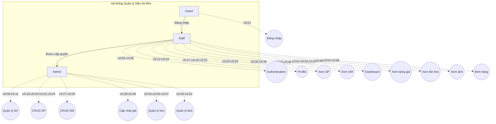

### 8.2 Use Case Diagram - Tổng quan hệ thống

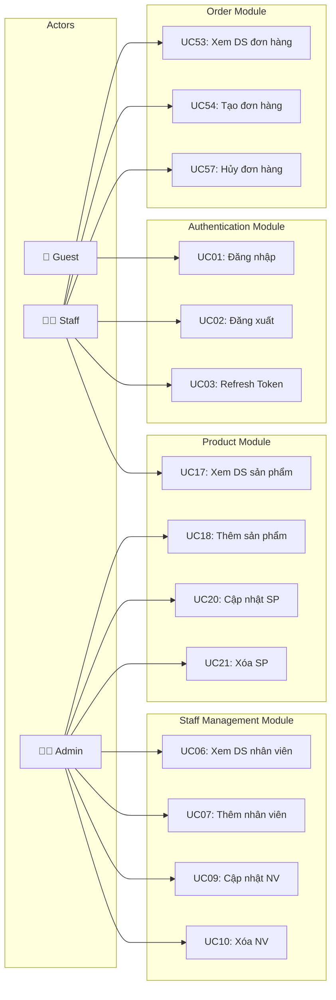

### 8.3 Use Case Diagram - Module Authentication

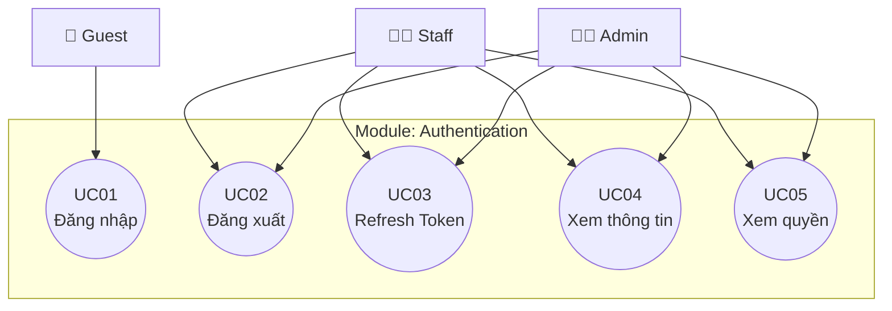

### 8.4 Use Case Diagram - Module Staff Management

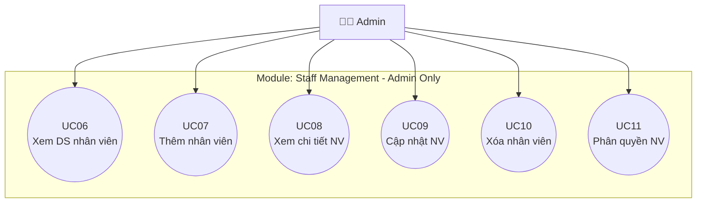

### 8.5 Use Case Diagram - Module Product Management

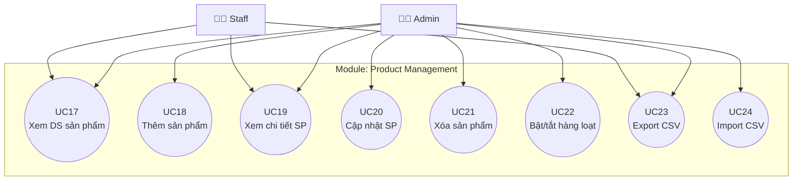

### 8.6 Use Case Diagram - Module Inventory Management

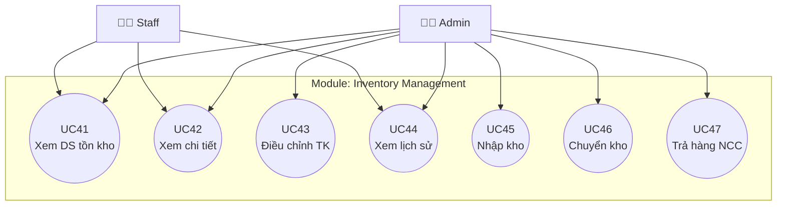

### 8.7 Use Case Diagram - Module Order Management

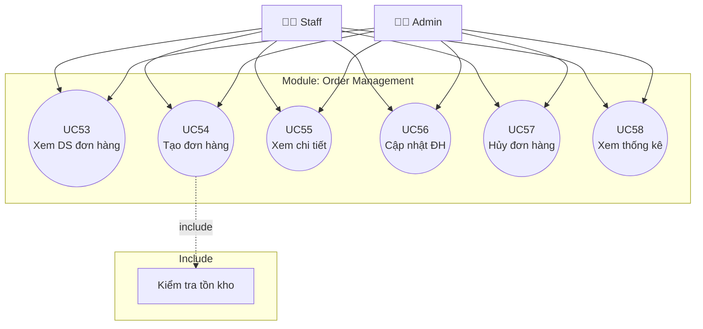

### 8.8 Sequence Diagram - Đăng nhập

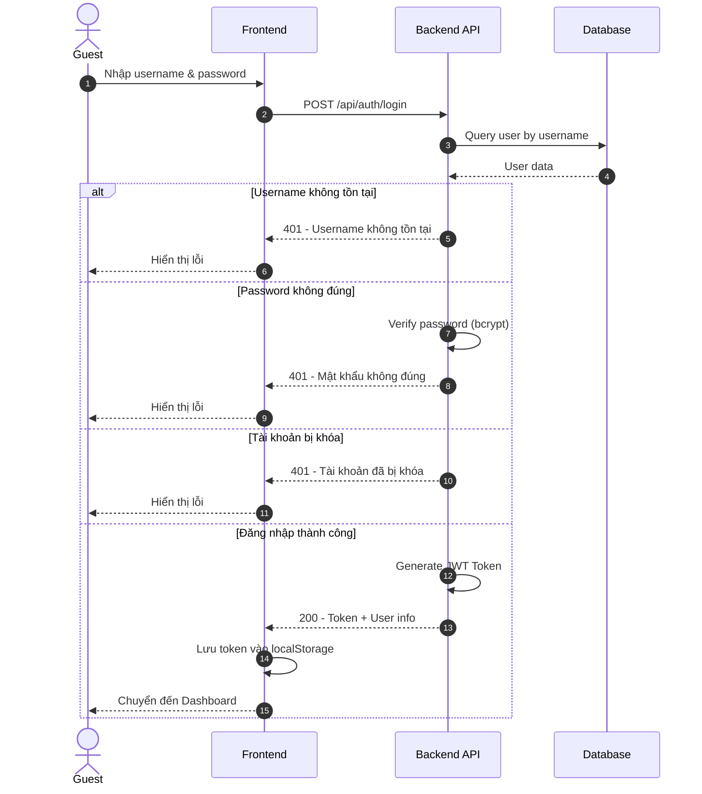

### 8.9 Sequence Diagram - Tạo đơn hàng

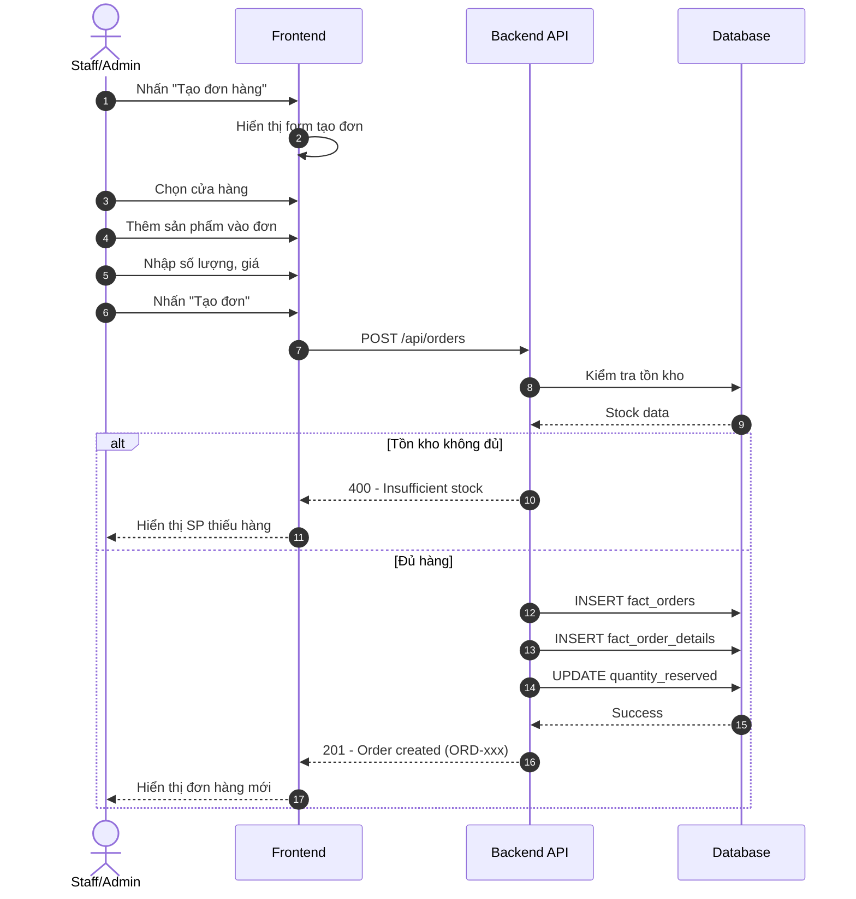

### 8.10 Sequence Diagram - Nhập kho

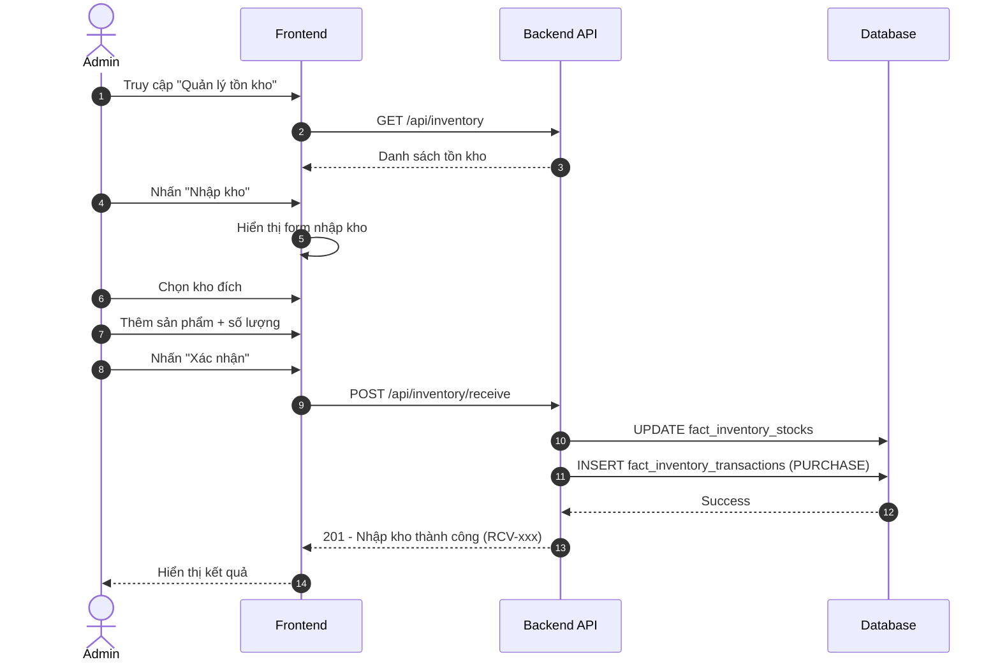

### 8.11 State Diagram - Trạng thái đơn hàng

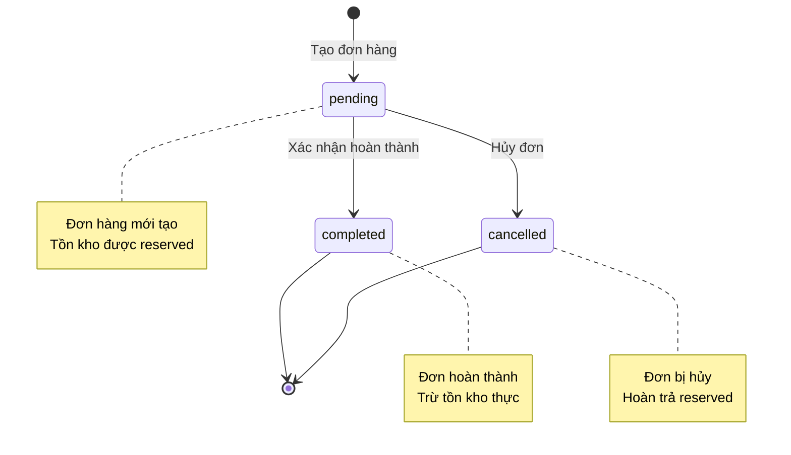

### 8.12 State Diagram - Trạng thái thanh toán

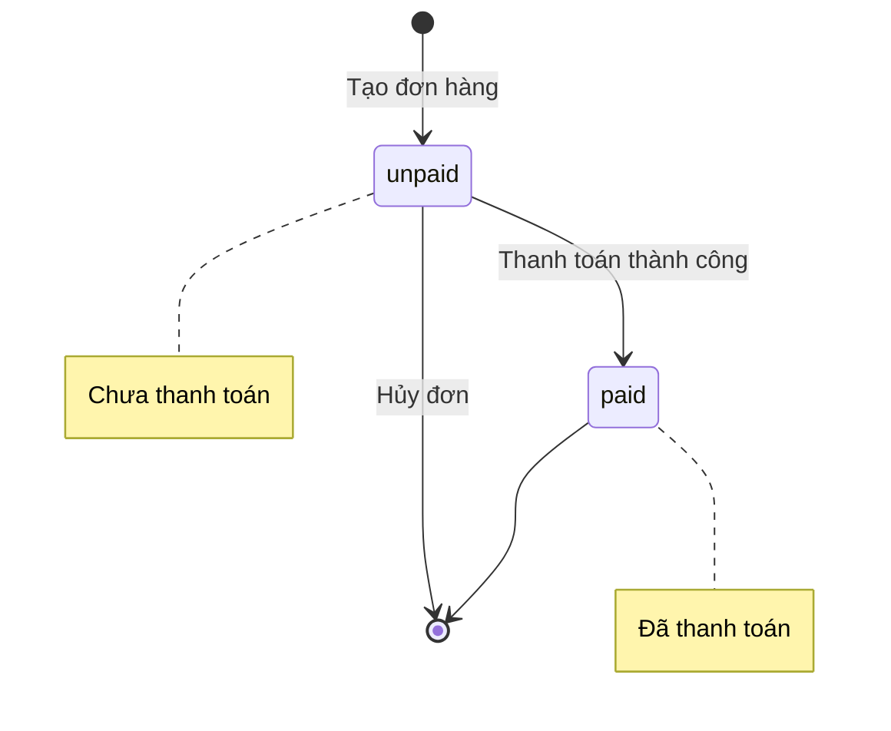

### 8.13 Activity Diagram - Quy trình tạo đơn hàng

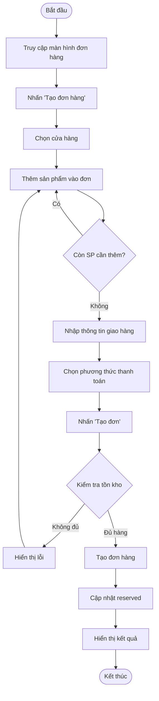

### 8.14 Activity Diagram - Quy trình nhập kho

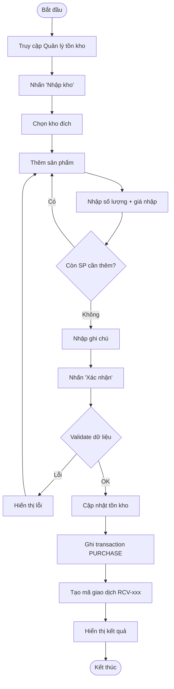

### 8.15 Class Diagram - Entity Relationships

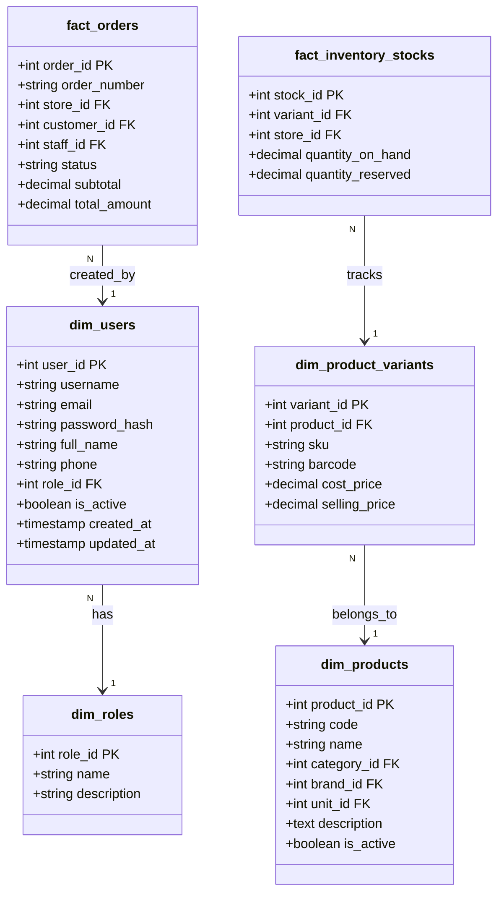

### 8.16 ER Diagram - Database Schema

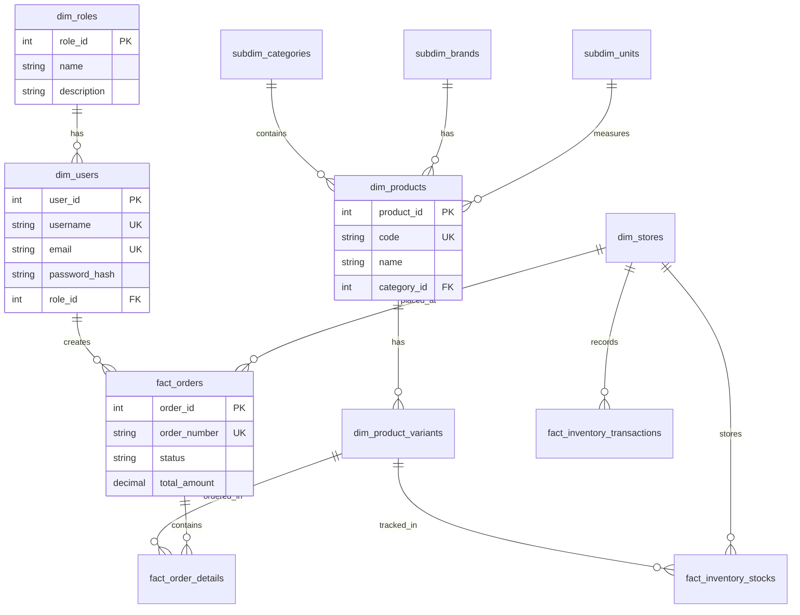

---

## 9. PHỤ LỤC

### 9.1 Bảng trạng thái đơn hàng

| Trạng thái | Mã | Mô tả |
|------------|:--:|-------|
| Chờ xử lý | `pending` | Đơn hàng mới tạo, chưa xử lý |
| Hoàn thành | `completed` | Đơn hàng đã giao thành công |
| Đã hủy | `cancelled` | Đơn hàng bị hủy |

### 9.2 Bảng trạng thái thanh toán

| Trạng thái | Mã | Mô tả |
|------------|:--:|-------|
| Chưa thanh toán | `unpaid` | Khách chưa thanh toán |
| Đã thanh toán | `paid` | Khách đã thanh toán đủ |

### 9.3 Các loại giao dịch kho

| Mã | Tên | Ảnh hưởng tồn kho | Mô tả |
|----|-----|:-----------------:|-------|
| `PURCHASE` | Nhập hàng từ NCC | +1 | Nhận hàng từ nhà cung cấp |
| `SALE` | Bán hàng | -1 | Xuất hàng khi bán |
| `RETURN_IN` | Khách trả hàng | +1 | Khách trả lại sản phẩm |
| `RETURN_OUT` | Trả hàng NCC | -1 | Trả hàng cho nhà cung cấp |
| `TRANSFER_IN` | Chuyển kho vào | +1 | Nhận hàng từ kho khác |
| `TRANSFER_OUT` | Chuyển kho ra | -1 | Chuyển hàng sang kho khác |
| `ADJUSTMENT` | Điều chỉnh tồn | ±0 | Điều chỉnh kiểm kê |

### 9.4 Cấu trúc Role và Permission

| Role ID | Role Name | Mô tả |
|:-------:|-----------|-------|
| 1 | Admin | Toàn quyền hệ thống |
| 2 | Staff | Nhân viên bán hàng |

### 9.5 Các API Endpoints chính

| Module | Method | Endpoint | Actor |
|--------|--------|----------|-------|
| Auth | POST | /api/auth/login | Guest |
| Auth | POST | /api/auth/logout | Staff, Admin |
| Staff | GET | /api/staff | Admin |
| Staff | POST | /api/staff | Admin |
| Products | GET | /api/products | Staff, Admin |
| Products | POST | /api/products | Admin |
| Orders | GET | /api/orders | Staff, Admin |
| Orders | POST | /api/orders | Staff, Admin |
| Inventory | GET | /api/inventory | Staff, Admin |
| Inventory | POST | /api/inventory/receive | Admin |

---

## 10. LỊCH SỬ THAY ĐỔI

| Phiên bản | Ngày | Người thực hiện | Mô tả thay đổi |
|-----------|------|-----------------|----------------|
| 1.0.0 | 19/01/2026 | Tú Nguyễn | Tạo tài liệu ban đầu |
| 2.0.0 | 27/01/2026 | Tú Nguyễn | Bổ sung Module 7-9 |
| 2.1.0 | 28/01/2026 | Tú Nguyễn | Bổ sung Module 10 (Orders) |
| 3.0.0 | 29/01/2026 | Tú Nguyễn | **Đơn giản hóa hệ thống về 2 roles (Admin, Staff)**<br>- Xóa bỏ Manager role<br>- Cập nhật ma trận quyền hạn<br>- Thêm Mermaid diagrams thay ASCII<br>- Bổ sung Sequence, State, Activity, Class, ER diagrams |

---

**Ghi chú:** Tài liệu này là phiên bản làm việc và có thể được cập nhật trong quá trình phát triển dự án.
